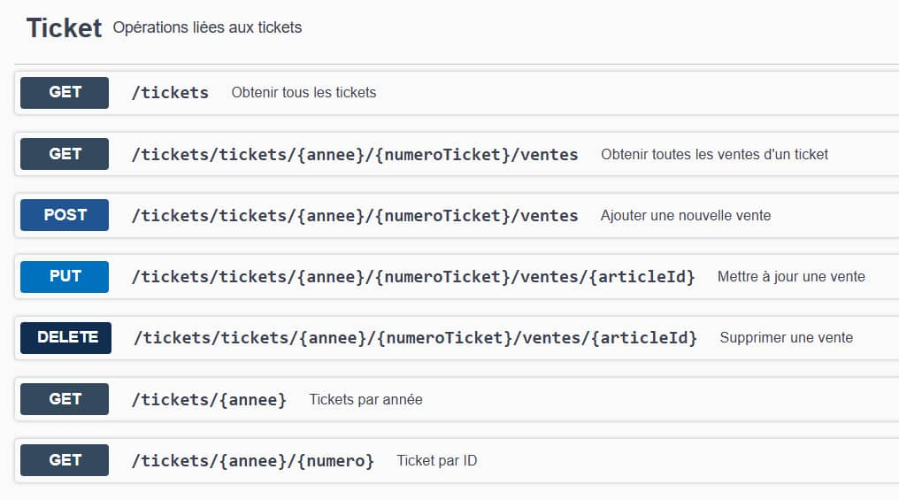
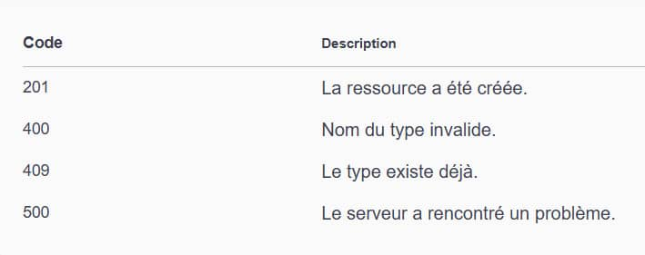

<div align="center">
  <h1>Brewshop - Projet de Gestion de Ventes de Bières</h1>
  
</div>

## Description

Ce projet est une API RESTful développée avec **Quarkus**, permettant de gérer un catalogue de bières et leurs ventes. Il permet de gérer plusieurs entités telles que les **articles**, **couleurs**, **marques**, **types de bière**, **pays**, **continents**, ainsi que les **tickets de vente** et les **ventes associées**.

L'API offre des fonctionnalités de **CRUD** (Création, Lecture, Mise à jour, Suppression) pour chacune de ces entités, ainsi que la gestion des relations complexes entre elles, comme la relation entre les articles et les tickets de vente via la table associative `VENDRE`.

Le projet inclut également une gestion du **stock** pour chaque article, qui est mis à jour automatiquement à chaque vente.

## Aperçu Visuel

### 1. Endpoints liés à la ressource Ticket


### 2. Inclusion conditionnelle d'informations supplémentaires via un booléen


### 3. Exemple de résultat d'un GET


### 4. Documentation OpenAPI


## Fonctionnalités Principales

- **CRUD complet pour les articles** : Ajout, modification, suppression et récupération des articles.
- **Gestion des ventes** : Enregistrement des ventes, calcul du stock et association des articles aux tickets de vente.
- **Gestion des relations complexes** : Associations entre les articles, marques, types de bières, couleurs, etc.
- **Formatage des noms** : Utilisation de services de formatage des noms pour garantir la cohérence des données.
- **Validation et gestion des erreurs** : Vérification des stocks, validation des données entrantes, gestion des erreurs comme le stock insuffisant ou les entités non trouvées.

## Technologies Utilisées

- **Quarkus** : Framework Java pour construire des applications RESTful.
- **Hibernate ORM avec Panache** : Gestion des entités et des relations dans une base de données relationnelle.
- **MSSQL** : Base de données utilisée pour stocker les entités (selon l'environnement).
- **Swagger UI** : Interface pour tester et documenter les endpoints de l'API.
- **HATEOAS** : Implémentation de liens hypermédias pour enrichir les réponses API.

## Installation

**Configurer la base de données**

Modifier les paramètres de connexion à la base de données dans le fichier application.properties :

quarkus.datasource.db-kind=mssql

quarkus.datasource.username=votre-utilisateur

quarkus.datasource.password=votre-mot-de-passe

quarkus.datasource.jdbc.url=jdbc:sqlserver://localhost:1433;databaseName=db-name


**Running the application in dev mode**

You can run your application in dev mode that enables live coding using:

```shell script
./mvnw compile quarkus:dev
```

> **_NOTE:_**  Quarkus now ships with a Dev UI, which is available in dev mode only at <http://localhost:8080/q/dev/>.

**Accéder à Swagger UI**

Ouvrez le navigateur à l'adresse suivante pour accéder à l'interface Swagger :

http://localhost:8080/doc/

## Exemples d'Endpoints

**Articles**

Récupérer tous les articles :
```shell script
GET /articles/
```

Ajouter un nouvel article :
```shell script
POST /articles
{
"nomArticle": "Bière Blonde",
"prixAchat": 5.50,
"volume": 33,
"titrage": 5.5,
"nomMarque": "Brasserie XYZ",
"nomCouleur": "Blonde",
"nomTypeBiere": "Pilsner"
}
```

Mettre à jour un article :
```shell script
PUT /articles/{id}
{
"nomArticle": "Bière Ambrée",
"prixAchat": 6.00
}
```

Supprimer un article :
```shell script
DELETE /articles/{id}
```

Ventes
Ajouter une vente :
```shell script
POST /tickets/{annee}/{numeroTicket}/ventes
{
"idArticle": 1,
"quantite": 10,
"prixVente": 7.00
}
```

## Rappel : Inclure l'URI du continent dans le corps de la réponse

Pour inclure l'**URI du continent** dans le **corps de la réponse**, il suffit de décommenter dans les classes **`DTO`** et **`Resources`**.

## Améliorations Futures
Voici quelques fonctionnalités et améliorations prévues qui seront ajoutées à l'API dans les prochaines itérations :

**HATEOAS** : Intégration de liens hypermédias dans les réponses de l'API pour une meilleure navigation des ressources.

**JSON Views** : Utilisation des @JsonView pour adapter dynamiquement la structure des réponses en fonction du contexte (par exemple, afficher plus d'informations pour les administrateurs ou certaines requêtes spécifiques).

**Equals et HashCode avec Lombok** : Ajout des annotations Lombok @EqualsAndHashCode pour améliorer la gestion des comparaisons d'objets et leur cohérence dans les collections.

**SoftDelete pour Article** : Implémentation d'une suppression "douce" (soft delete) des articles, permettant de masquer les articles supprimés sans les retirer complètement de la base de données.

**MapStruct** : Introduction de MapStruct pour automatiser le mapping entre les entités et les DTO, afin de réduire le code boilerplate.

**Javadoc** : Ajouter une documentation complète avec Javadoc pour chaque classe, méthode, et paramètre pour améliorer la lisibilité et la maintenabilité du code.

**Protection des Endpoints** : Intégration de mécanismes d'authentification et d'autorisation pour protéger les différents endpoints selon les rôles des utilisateurs.

**Intégration d'une API externe pour les noms des pays** : Utilisation d'une API externe pour garantir que les noms des pays soient correctement formatés et validés selon des standards internationaux.

## Related Guides

- JDBC Driver - Microsoft SQL Server ([guide](https://quarkus.io/guides/datasource)): Connect to the Microsoft SQL
  Server database via JDBC
- SmallRye OpenAPI ([guide](https://quarkus.io/guides/openapi-swaggerui)): Document your REST APIs with OpenAPI - comes
  with Swagger UI
- Hibernate ORM with Panache ([guide](https://quarkus.io/guides/hibernate-orm-panache)): Simplify your persistence code
  for Hibernate ORM via the active record or the repository pattern
- RESTEasy Classic ([guide](https://quarkus.io/guides/resteasy)): REST endpoint framework implementing Jakarta REST and
  more